  

# Computer Graphics: HW1

Implementazione di filtri per immagini utilizzando la libreria [**Yocto/GL**](https://github.com/xelatihy/yocto-gl).

  

# Funzionalità Richieste

  

-  **Tone mapping**

	- Expoure compensation

	- Filmic correction (fit del tonemapping cinematografico ACES)

	- sRGB color space

-  **Color tint**

-  **Saturation**

-  **Contrast**

-  **Vignette**

-  **Film grain**

-  **Mosaic Effect**

-  **Grid Effect**

  

# Funzionalità Extra
Implementare filtri già fatti è onestamente poco interessante. Come extra credit suggeriamo di creare filtri aggiuntivi.
 # Grey
**Difficoltà:** Facile

Il filtro simula un effetto scala di girgi sulla foto a cui viene applicato.

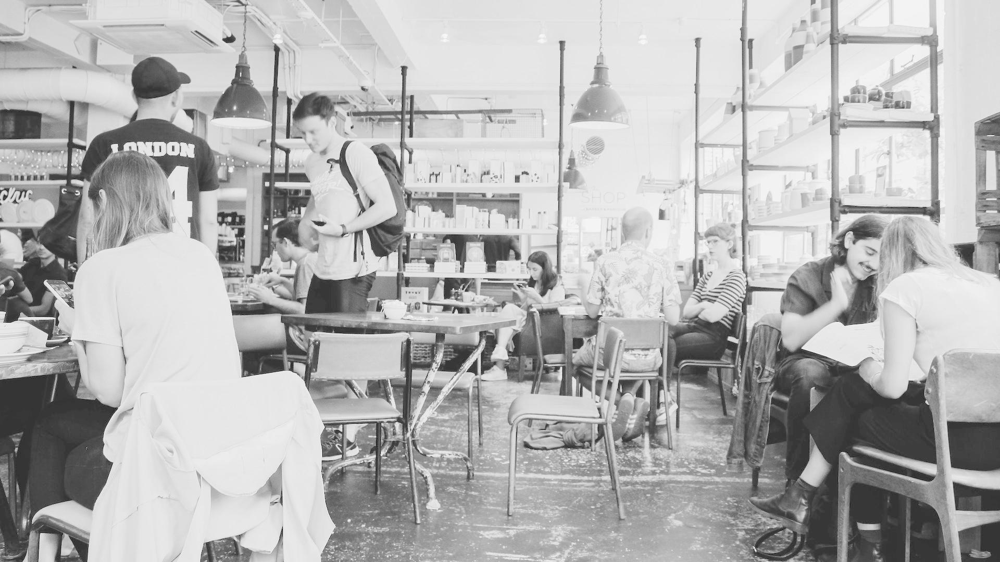

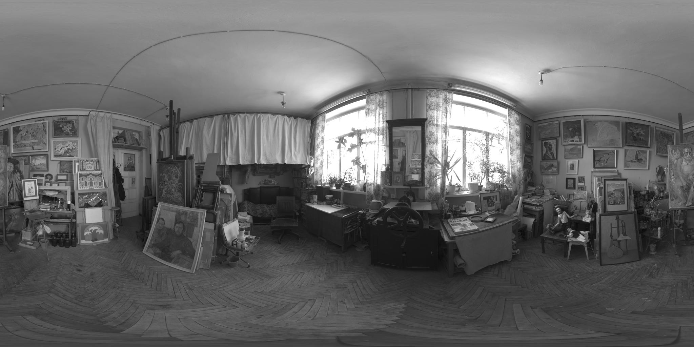

Source: https://rosettacode.org/wiki/Grayscale_image

   

# Sketch

**Difficoltà:** Facile

Il filtro simula un effetto disegnato sulla foto a cui viene applicato.

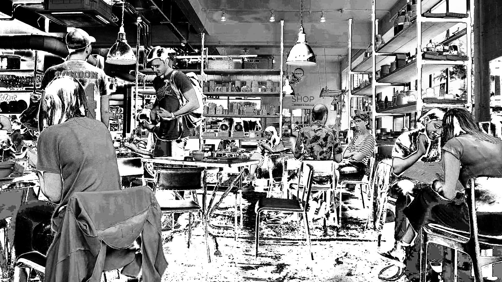

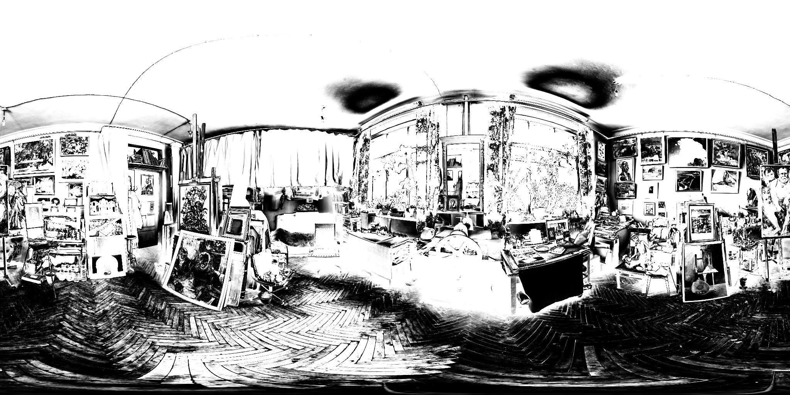

Source: https://www.shadertoy.com/view/7scSRX

  

# VHS

**Difficoltà:** Facile

Il filtro simula un effetto videocassetta sulla foto a cui viene applicato.

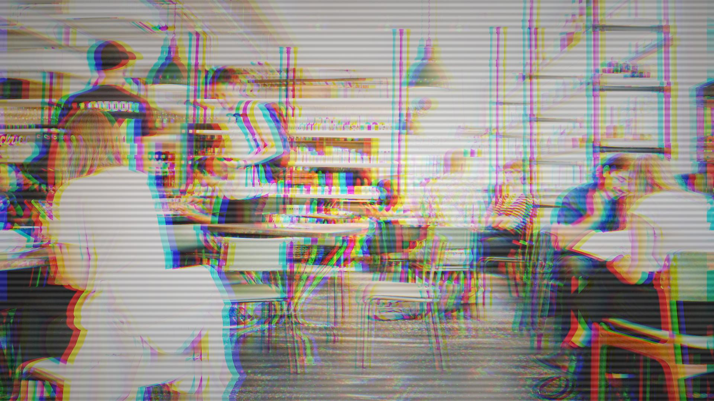

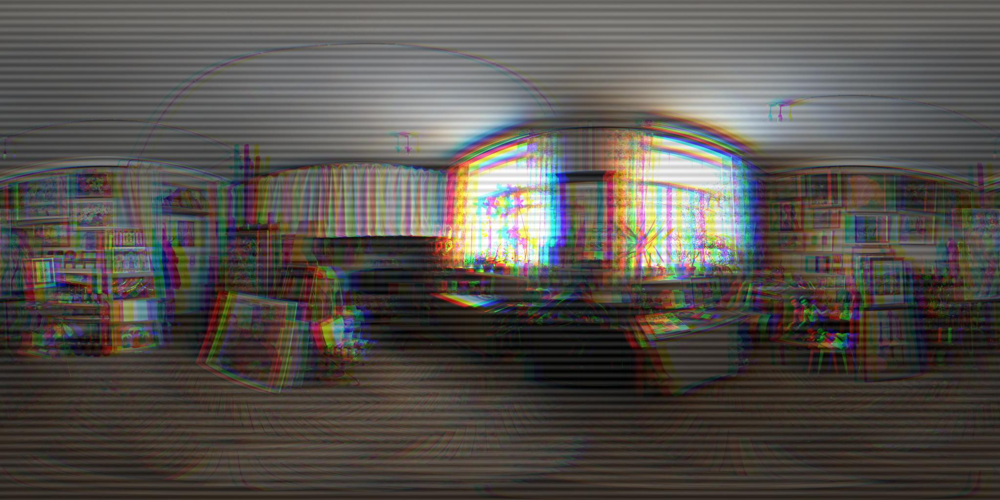

Source: https://www.shadertoy.com/view/Mt3yz4

  

# Attribute Clash

**Difficoltà:** Facile

Il filtro simula gli artefatti grafici noti come "[attribute clash](https://en.wikipedia.org/wiki/Attribute_clash)" sulla foto a cui viene applicato.

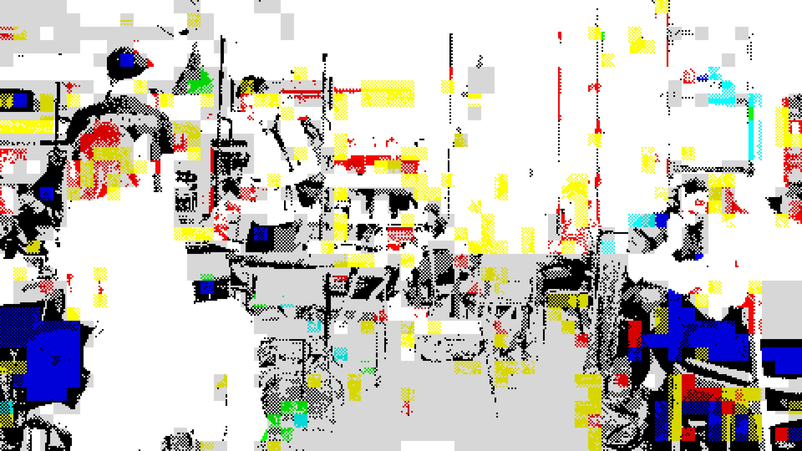

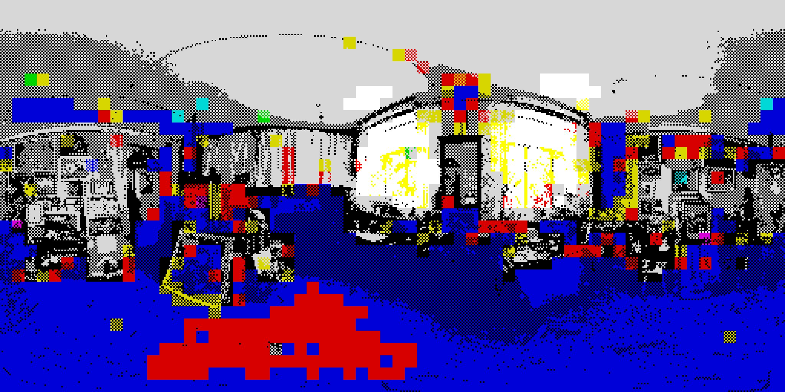

Source: https://www.shadertoy.com/view/XsfcD8

  

# Negative

**Difficoltà:** Facile

Il filtro simula un di pellicola negativa sulla foto a cui viene applicato.

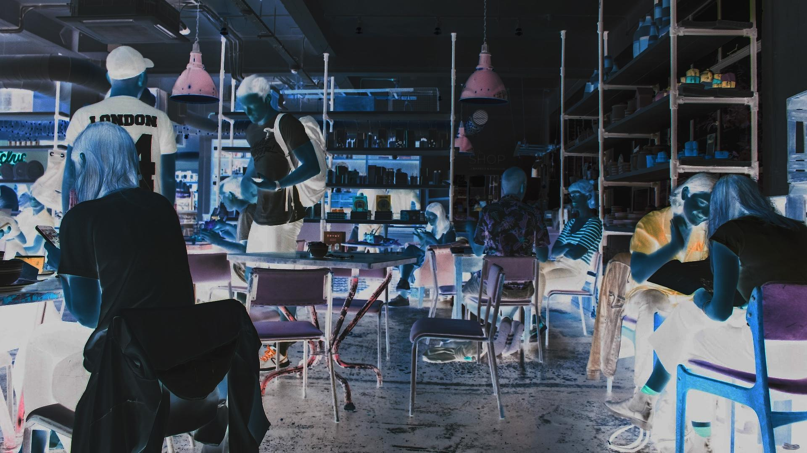

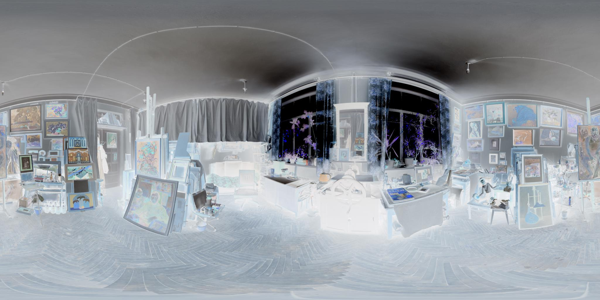

  

# Mirror
**Difficoltà:** Facile

Il filtro simula un effetto specchio in un certo punto dell'immagine dato in input. Se viene dato il valore 50% (come nella foto) specchia esattamente la foto a metà. Se vengono dati valori inferiori al 50% allora l'immagine verrà replicata più volte con lo stesso pattern, creando effetti più creativi.

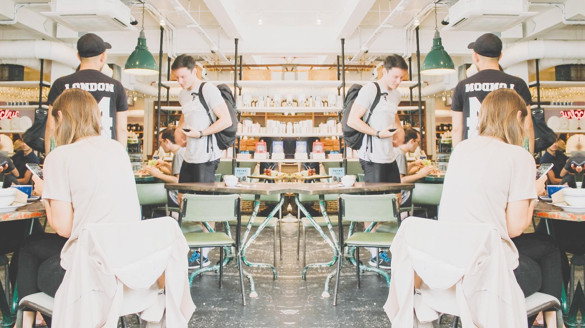

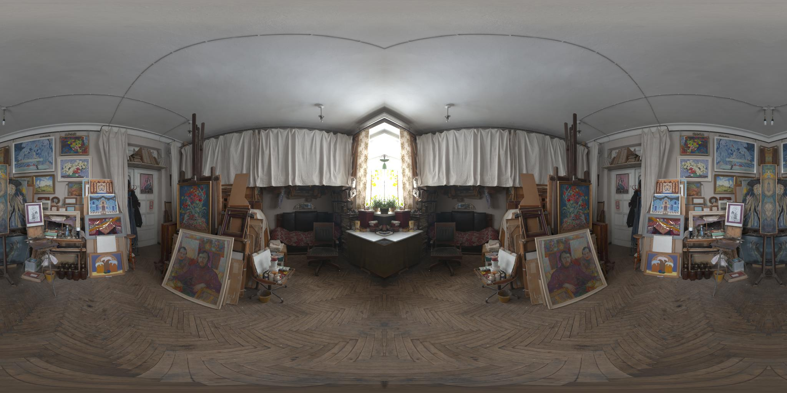

# Weighted Voronoi Stippling
**Difficoltà:** Medio

Il filtro simula un effetto puntinismo sulla foto a cui viene applicato.

 - Si trasforma l'immagine in scala di grigi
 - Si crea una mappatura di punti sull'immagine e si creano dei pesi in base all'intensità del loro colore
 - Si "rilassano" i punti in diverse iterazioni per un migliore posizionamento
 - Si disegnano i punti come cerchi di diversa grandezza su un'immagine bianca 

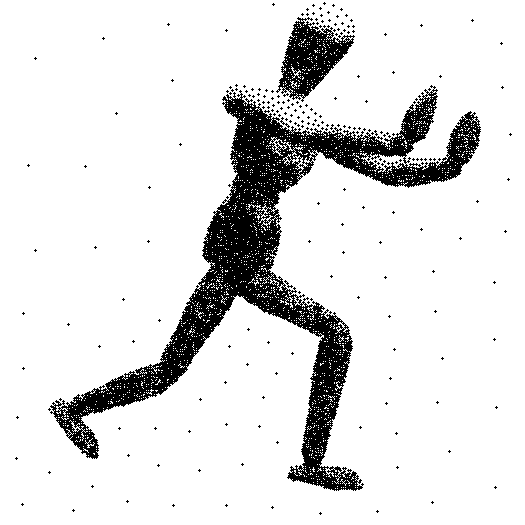

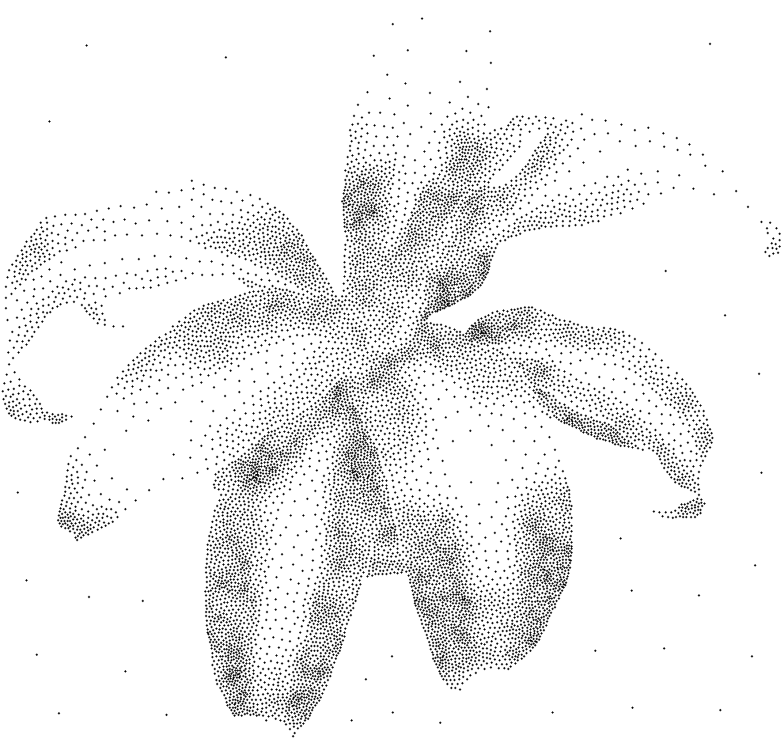

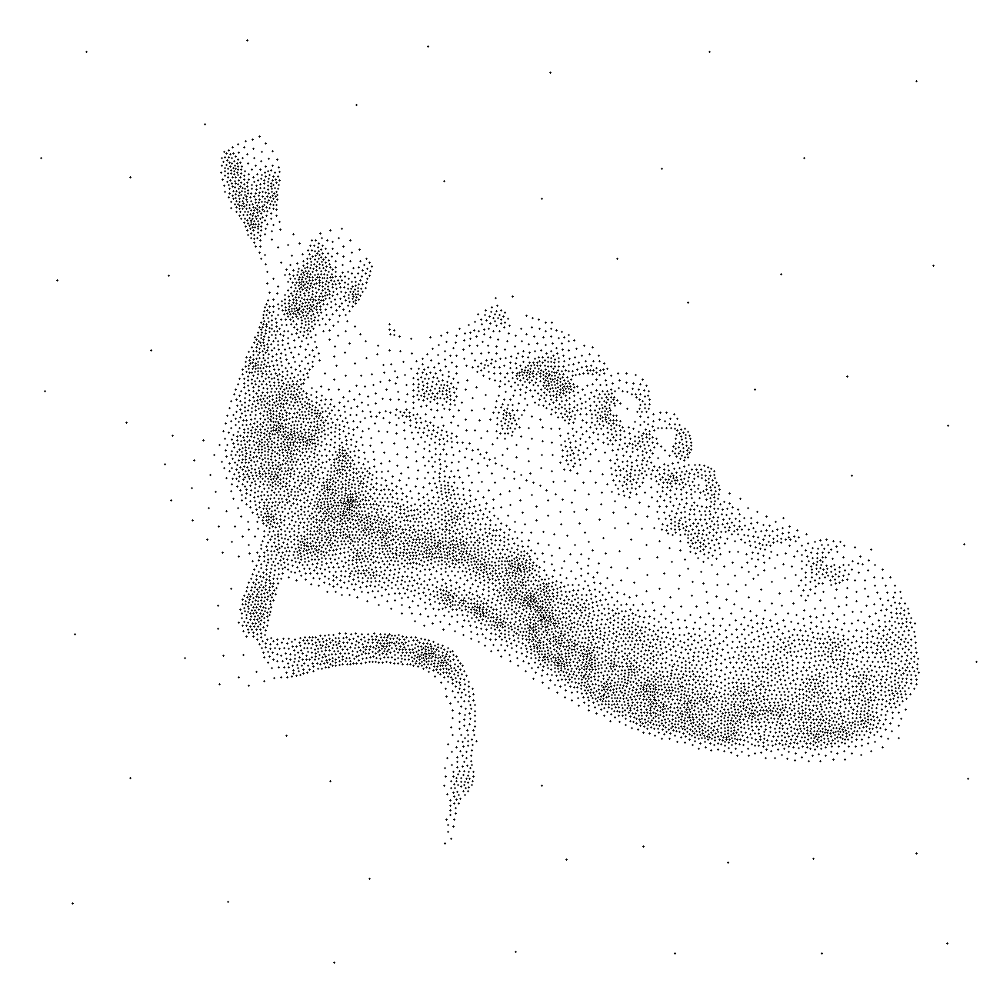

Source: https://maxhalford.github.io/blog/halftoning-2/